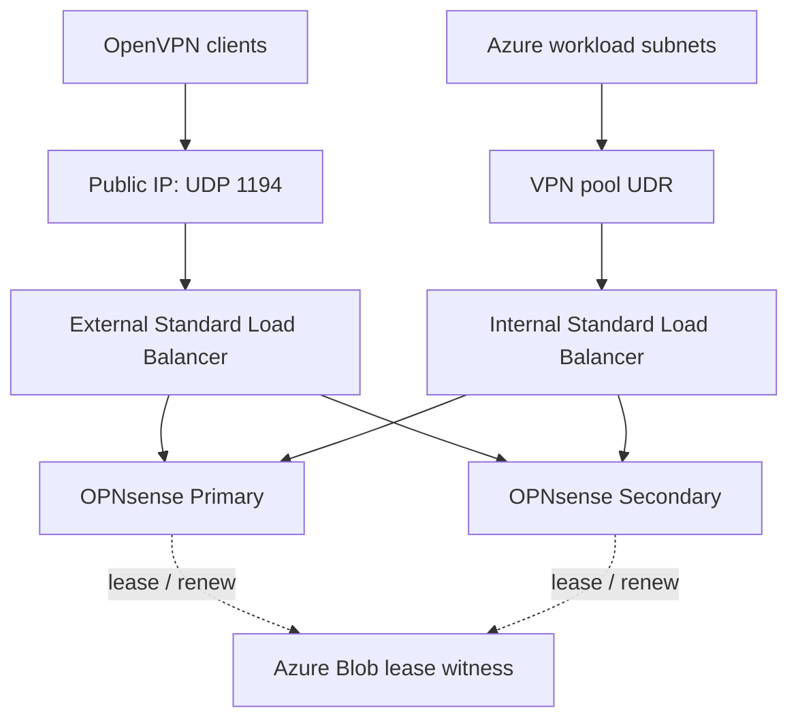

# Active-Backup OpenVPN on Azure

This fork adds `scenarioOption=Active-Backup` for a road-warrior OpenVPN service
with one public IPv4 endpoint. It is an implementation to validate in an Azure
staging environment before production, not a Microsoft or OPNsense certified HA
appliance. Local tests cover the election state machine and template generation;
they do not demonstrate live Azure failover or a successful FreeBSD bootstrap.

## Architecture



* Two VMs in an availability set, with distinct NIC IPs. This protects against
  host/update-domain failures, not a whole region or availability-zone outage.
* A private ZRS blob container arbitrates a 60-second exclusive lease. Managed
  identities authenticate to Blob and Compute; there are no storage keys in VMs.
* HTTP `/health` on port 8080 returns 200 only for the current lease holder while
  all monitored OpenVPN instances report `CONNECTED,SUCCESS` on their local
  management sockets. Both LBs use this probe, not the WebGUI's TCP 443.
* A candidate acquires the lease, powers off the peer through Azure Compute,
  observes `PowerState/stopped` or `PowerState/deallocated`, starts/verifies
  OpenVPN, then advertises health. **A lease alone is not fencing.**
* After an unclean takeover the new active starts the fenced peer again so it can
  return to standby. Fencing is a hard power-off (`skipShutdown=true`) and can
  interrupt disk writes. These VMs must be dedicated to this HA service.
* Both OpenVPN daemons may be running as warm standbys, but only one is eligible
  for traffic through the load balancers. Do not expose direct public OpenVPN
  endpoints or use inbound NAT rules for the VPN port.
* No preemption: a recovered Primary does not displace the healthy Secondary.
* A clean, verified stop can record a voluntary handover under the lease. The
  successor then need not power-cycle a firewall undergoing maintenance.
* HTTP health expires after 12 seconds without a successful daemon check, and
  lease validity expires locally 15 seconds before the nominal lease duration.
  A suspended process cannot renew an already locally expired lease and become
  active without a new election.

This is **service availability with client reconnection**, not replication of
OpenVPN TLS sessions, address leases or established application connections.
Expect roughly a lease interval **plus** Azure fencing, service startup, LB probe
convergence and client retry time after abrupt failure. There is no measured RTO
or subsecond guarantee. Control-plane delays may extend recovery to minutes.
If Blob or Compute is unavailable, the design prefers unavailable service over an
unfenced promotion. It does not detect every WAN/routing/application-path failure:
the local OpenVPN check is not a synthetic end-to-end client login.

## Deploy a new pair

Use a **new resource group** for the first test. Do not change the scenario on an
existing production deployment in place: VM availability-set membership cannot
be retrofitted and bootstrap can replace OPNsense configuration. Migration from
an existing pair needs a separate backup/restore and cutover plan.

Prerequisites: Azure CLI/Bicep, a region with Standard_ZRS and the chosen VM size,
and rights to create managed identities, a custom role and role assignments.
The custom role permits only read/instanceView/powerOff/start, assigned to the
opposite VM. Blob Data Contributor is scoped to the dedicated witness container.
RBAC propagation can take minutes; the agent stays unhealthy and retries.

1. Copy `bicep/active-backup.parameters.json` to a local parameters file.
2. Set `ManagementSourceCIDR` to your administrator's actual public IPv4 CIDR.
   The example uses a documentation-only IP. The template default is loopback,
   deliberately preventing Internet management until a real source is supplied.
3. Choose VM size, VNet/subnet settings and the desired OPNsense release. The
   example preserves upstream's 26.1 default; set `OpnVersion` explicitly for
   another available release (for example your 26.7). Use the same on both nodes.
4. Pin script downloads to the reviewed commit rather than a moving branch.

```bash
revision=$(git rev-parse HEAD)
az vm image terms accept \
  --urn thefreebsdfoundation:freebsd-14_1:14_1-release-amd64-gen2-zfs:14.1.0
az deployment group what-if --resource-group YOUR_NEW_RG \
  --template-file bicep/main.bicep --parameters @YOUR_PARAMETERS.json \
  OpnScriptURI="https://raw.githubusercontent.com/Galvy/opnazure/${revision}/scripts/"
az deployment group create --resource-group YOUR_NEW_RG \
  --template-file bicep/main.bicep --parameters @YOUR_PARAMETERS.json \
  OpnScriptURI="https://raw.githubusercontent.com/Galvy/opnazure/${revision}/scripts/"
```

Management remains `https://PUBLIC_IP:50443` and `:50444`, mapped to individual
nodes. Change the upstream default root password on **both** before arming.
The new agent initially stays **disarmed**: both LB probes are down until an
actual OpenVPN instance, certificates and authentication are configured. The
outbound LB rule and management inbound NAT rules do not depend on these probes.

## Configure the road-warrior service

On each firewall, configure **VPN > OpenVPN > Instances**, server mode, IPv4 UDP,
port matching `OpenVpnPort` (1194 by default), TUN initially without DCO, and a
listener reachable on that node's WAN private IP (or appropriate wildcard).
Use a common client-trusted CA, compatible server identity verification,
TLS-crypt material when enabled, users/authentication backend, CRL and pushed
routes/DNS. Use a VPN pool such as `10.250.0.0/24`, not overlapping your networks.
The same pool is possible here because only one backend serves clients; IP
assignment and client sessions still are not shared.

Configure the OpenVPN firewall group rules for required destinations on **both**
nodes. Bootstrap only permits the listener; it does not grant decrypted VPN
clients unrestricted access. For the initial test use split tunneling to Azure.
Full-tunnel Internet access additionally needs explicit DNS and outbound NAT.

For every Azure workload subnet reached by users, install a route:

| Destination | Next hop type | Next hop |
|---|---|---|
| VPN pool, e.g. `10.250.0.0/24` | Virtual appliance | `internalNextHop` template output |

The return path must use the ILB, **not either firewall's private IP**. Its probe
selects the same leader as the external LB. Also ensure OPNsense can route to each
workload subnet via its trusted interface/Azure gateway and that NSGs permit
traffic. Do not attach a default route back to the ILB on the firewall subnets:
that can loop the agent's Blob/Compute and Internet traffic. The optional Windows
sample route is not a substitute for routing all your actual workload subnets.

Keep both LB backend admin states at `None`. Do not manually set a standby to
`Down`: that would override the agent after automatic promotion. Avoid manual
`Up`, which would defeat the lease-controlled health checks.

The Active-Backup bootstrap disables the inherited primary XMLRPC configuration
because it has default credentials and could overwrite peer-local settings.
Synchronize certificates, OpenVPN, users and policy deliberately; verify the
OPNsense version's XMLRPC coverage, direction and credentials before enabling
selected sections. Do not synchronize NIC addresses, hostnames or HA agent files.
**Configuration replication is not performed by this agent.**

## Arm the pair

The agent controls only the instance UUIDs explicitly listed in
`/conf/opnazure-ha/instances.json`; legacy OpenVPN servers are not supported.
Find the UUID in the Instances API/GUI or the corresponding entry under
`OPNsense/OpenVPN/Instances` in the local `config.xml`. UUIDs may differ by node.

On **each** node, after confirming the daemon is running and authentication is
configured:

```sh
printf '%s\n' '["YOUR-OPENVPN-INSTANCE-UUID"]' > /conf/opnazure-ha/instances.json
chmod 600 /conf/opnazure-ha/instances.json
touch /conf/opnazure-ha/maintenance
touch /conf/opnazure-ha/armed
```

Then remove `/conf/opnazure-ha/maintenance` on Primary. The **first election will
power-cycle Secondary** to establish an unambiguous initial leader; do not perform
other maintenance on Secondary during initial arming. Verify Primary's localhost
probe and both Azure LB health metrics. After Secondary has rebooted, remove its
maintenance file too. It stays standby while Primary holds the lease.

```sh
curl -i http://127.0.0.1:8080/health
# Active: 200; standby/disarmed/maintenance/error: 503.
tail -n 50 /var/log/opnazure-ha.log
```

The agent is supervised by FreeBSD `daemon` and launched from
`/usr/local/etc/rc.syshook.d/start/95-opnazure-ha`. Persistent configuration/code
are in `/conf/opnazure-ha`. Confirm the hook, Python interpreter and agent still
work after each major OPNsense upgrade. Do not blindly re-run bootstrap on a
configured firewall. Back up `/conf/opnazure-ha` separately from OPNsense XML.

Export the OpenVPN client profile with `remote vpn.example.com 1194 udp` pointing
to the LB public IP. Configure keepalive/reconnect behaviour in server/client,
then test your actual client (OpenVPN Connect, GUI, Tunnelblick, etc.). MFA may
require fresh user interaction after reconnection. No automatic MFA bypass is
introduced by this design.

## Planned firmware upgrade

1. Put the **standby** into maintenance (`touch /conf/opnazure-ha/maintenance`),
   save its configuration and upgrade it. Leave the active node serving traffic.
2. Verify its hook/agent, OpenVPN configuration and version. Remove standby's
   maintenance file and confirm its daemon is ready. It does not preempt.
3. Put the current **active** into maintenance. The agent withdraws health,
   stops OpenVPN, verifies stop and releases its lease with a clean marker.
4. Wait until both Azure LBs select the upgraded node, reconnect a real client
   and test access to a workload. **Only then** upgrade the old active node.
5. Remove maintenance on the recovered node; it remains standby. There is no
   automatic failback that would interrupt users a second time.

If OpenVPN cannot be stopped or a fencing operation is already in flight, the
handover is not marked clean: the successor must fence. Check logs and the new
leader before touching the old node. A maintenance file on the active is a
request to hand over, not proof that it has completed.

## Staging acceptance tests (required before production)

Record elapsed time, Azure Activity Log, both probe metrics and client logs for:

- Healthy baseline: exactly one active probe, login works, Azure workload replies.
- Force-stop the active VM externally: other node fences/confirms stop and takes
  over; client reconnects to the **same public endpoint**; old VM rejoins standby.
- Kill the active agent or suspend it longer than 60 seconds, then resume: no
  simultaneous eligible backends; a stale process cannot regain leadership.
- Stop/crash active OpenVPN: health goes down and healthy peer takes over.
- Deny the candidate's Compute powerOff permission: it must not promote.
- Block witness access / expire credentials: no unfenced promotion; restore and
  verify recovery. Do not delete or break the witness lease as a recovery shortcut.
- Upgrade handover: old active must not be power-cycled during a verified clean
  handover. Recovery/failback must not preempt a healthy leader.
- Check UDP tunnel and TCP application behaviour; expect reconnects, not seamless
  migration. Test CRL, authentication failures and MFA on both nodes separately.

The agent covers VM/process failure and local OpenVPN readiness. It does not
provide regional DR, certificate/configuration recovery, an independent external
synthetic VPN check or an availability guarantee during an Azure control-plane
outage. Never share this witness blob between different firewall pairs.

## References

- [Azure Blob leases](https://learn.microsoft.com/en-us/rest/api/storageservices/lease-blob)
- [Compute hard power-off](https://learn.microsoft.com/en-us/rest/api/compute/virtual-machines/power-off?view=rest-compute-2024-11-01)
- [Azure LB health behaviour](https://learn.microsoft.com/en-us/azure/load-balancer/load-balancer-custom-probe-overview)
- [OPNsense OpenVPN service control](https://github.com/opnsense/core/blob/master/src/opnsense/service/conf/actions.d/actions_openvpn.conf)
